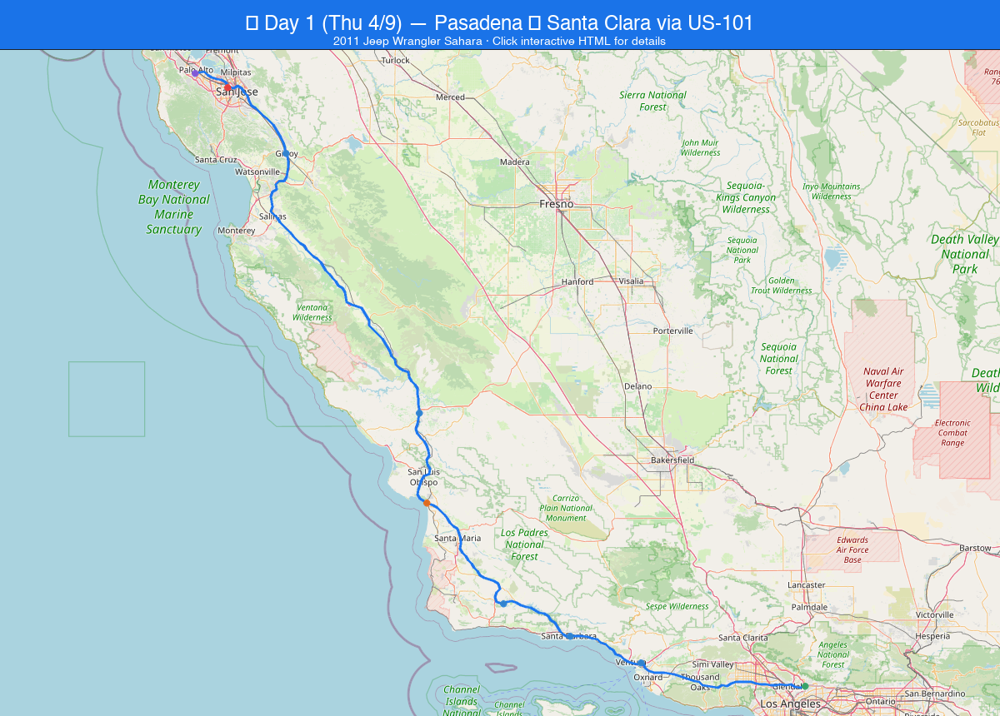
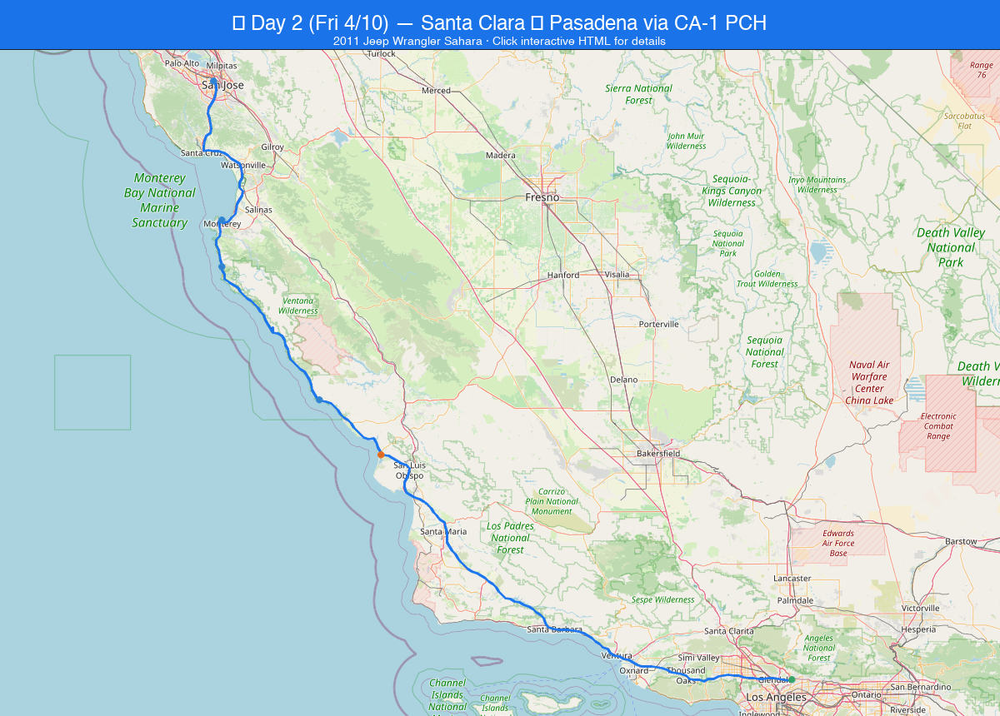

# An AI Design Trip Sample 🚙

     
  
   
    
   

> **A tutorial example showing how to use AI (GitHub Copilot) to plan a complete road trip — from route planning to interactive maps to packing lists.**

This project was built entirely through a conversation with GitHub Copilot (Claude Opus 4.6) in VS Code. Every file — the trip plan, the maps, the generation scripts — was created by AI through iterative prompts and refinements. The [chat log](CHAT_LOG.md) documents the full conversation.

---

## What's Inside

| File | Description |
|---|---|
| [Pasadena_to_SantaClara_Trip_Plan.md](Pasadena_to_SantaClara_Trip_Plan.md) | Complete trip guide with stops, timing, fuel strategy, packing list, and cost estimate |
| [day1_map.html](day1_map.html) | Interactive Day 1 map — US-101 North (open directly in browser) |
| [day2_map.html](day2_map.html) | Interactive Day 2 map — CA-1 PCH South (open directly in browser) |
| [day1_map.png](day1_map.png) | Static Day 1 route image |
| [day2_map.png](day2_map.png) | Static Day 2 route image |
| [trip_map.html](trip_map.html) | Combined map page with Google Maps embeds (requires local server) |
| [generate_maps.py](generate_maps.py) | Python script to regenerate maps with OSRM road-accurate routing |
| [CHAT_LOG.md](CHAT_LOG.md) | Full conversation log showing how the project was built step by step |

---

## The Trip

**Pasadena ↔ Santa Clara, CA** — A 2-day, 770-mile round trip in a 2011 Jeep Wrangler Sahara for 2 persons.

### Day 1 (Thursday) — US-101 North
Pasadena → Ventura → Santa Barbara → Solvang → Pismo Beach → Paso Robles → Gilroy → Santa Clara → **Stanford University** (evening visit)

### Day 2 (Friday) — CA-1 Pacific Coast Highway South 🌊
Business meeting (9–11 AM) → Monterey → **17-Mile Drive & Lone Cypress** → Bixby Bridge / Big Sur → San Simeon (elephant seals) → Morro Bay (dinner) → Pasadena




---

## Tutorial: How to Use AI to Plan a Trip

This project demonstrates a practical workflow for using AI assistants to build a complete travel guide. Here's what we learned:

### 1. Start Simple, Then Refine
> "Plan a two-day trip from Pasadena to Santa Clara, driving a 2011 Jeep Wrangler Sahara, with stops every 1.5–2 hours."

Don't try to specify everything upfront. Start with the basics and iterate.

### 2. Correct and Redirect
The AI initially planned a one-way trip. A simple correction — *"two days round trip"* — fixed it. Later:
- *"Drive alongside the ocean on the way back"* → switched return from I-5 to CA-1 PCH
- *"The business meeting is 9:00 to 11:00 AM"* → shifted all Day 2 timings
- *"Will we pass by The Lone Cypress?"* → added 17-Mile Drive detour

### 3. Ask About Real-World Conditions
- *"The gas fare has had a significant rise"* → AI checked GasBuddy for current prices ($5.90/gal vs. $4.80 estimate)
- *"Is Stanford worth visiting after sunset?"* → AI analyzed sunset times, parking rules, and lighting conditions

### 4. Generate Multiple Output Formats
One conversation produced:
- **Markdown** trip guide with detailed stop descriptions
- **Interactive HTML maps** (Folium + OpenStreetMap) — road-accurate via OSRM routing
- **Static PNG images** — shareable anywhere
- **Google Maps embeds** — with navigation links
- **Python script** — reproducible map generation

### 5. Handle Logistics
- *"Cost for two persons, on the way back will add 105 kg package"* → AI recalculated fuel economy with extra weight, doubled meal costs, and added safety tips for securing cargo on winding roads

### 6. Version Control Everything
Each iteration was committed to GitHub with descriptive messages, creating a clear history of how the plan evolved. The [commit history](https://github.com/yuleshow/An-AI-Design-Trip-Sample/commits/main) tells the story.

---

## How to Use the Maps

### Interactive Maps (Recommended)
Simply double-click `day1_map.html` or `day2_map.html` — they open in any browser with no server needed. Click markers to see stop details.

### Google Maps Version
```bash
cd "An AI Design Trip Sample"
python3 -m http.server 8090
# Open http://localhost:8090/trip_map.html
```

### Regenerate Maps
```bash
pip install folium staticmap pillow polyline
python3 generate_maps.py
```

---

## Tools Used

| Tool | Purpose |
|---|---|
| **GitHub Copilot** (Claude Opus 4.6) | AI assistant — planned routes, wrote all code and content |
| **VS Code** | Editor and terminal |
| **Folium** + **OpenStreetMap** | Interactive map generation |
| **OSRM** (Open Source Routing Machine) | Road-accurate route data (10,000–15,000 points per route) |
| **staticmap** + **Pillow** | Static PNG map images |
| **Google Maps** | Embedded maps and navigation links |
| **GasBuddy** | Real-time gas price data |
| **GitHub CLI** (`gh`) | Repo creation and push |

---

## License

This is a tutorial sample project. Feel free to use it as a template for your own AI-assisted trip planning.

---

*Built with ❤️ by a human and an AI, one prompt at a time.*
